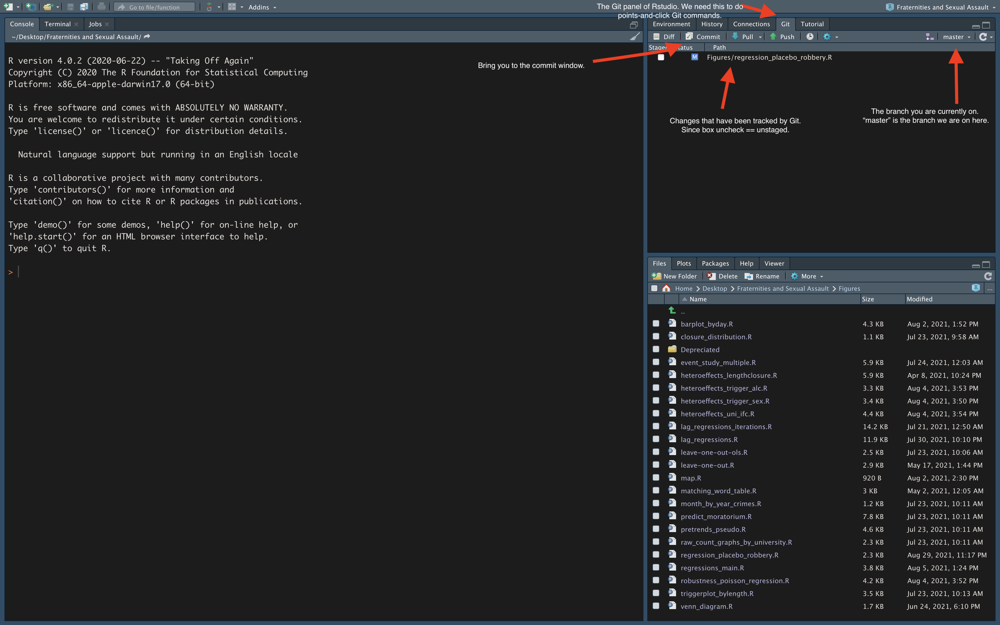
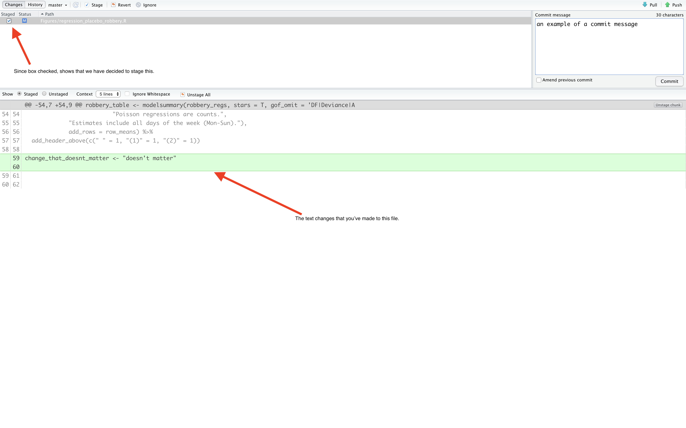
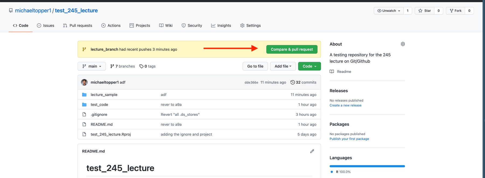

```{r, echo = F}
library(knitr)
```


# Getting Started

Git is a version control system. Think of it as a better Dropout - you can track changes of your files and revert back to old versions of projects, but all without pinging your internet every microsecond. Why not just use Dropbox? I will not explicitly tell you why you should not use certain software (by all means, use what works for you), but I will tell you some of the benefits of Git:

* It allows you to revert to previous versions of your work.
* Most private sector jobs we will be qualified for use a combination of Git and Github.
* It sends a signal to employers (and other academics) that you have ability to learn new practical skills.
* It is excellent for collaborating.
* It integrates seamlessly with RStudio.

Unfortunately, Git has a steep learning curve. This is mainly due to the jargon that comes along with it. I will do my best to define terms, and hopefully make the process a little less confusing.

The next few subsections are dedicated to getting all of software installed and communicating with each other for integration. Honestly, this is an extremely painful process without good resources. Fortunately, [there is a good one](https://happygitwithr.com/install-r-rstudio.html) made by Jenny Bryan that I will be following closely throughout this document. 

## Installing Git 

Git is much different from Github. Git is the actual version control software, while Github is hosting service that provide a home for your Git-based projects. Think of Github as an online repository of files that Git can communicate with to make changes. Before we can get to Github, we need to install the Git software on our local machine. But first, let's check if you installed it at one point already (all of us probably tried learning at one point). Open up the terminal in RStudio (Tools -> Terminal -> New Terminal) and type in the following:

```{bash}
which git
```

Did you get output showing you a file path similar to the one shown above? Great! You have Git installed and are ready to move on to the next section. If not, you should see something like `git: command not found` and you will need to install Git. Here is where to download:

Windows:

* https://gitforwindows.org/

Mac:

* http://git-scm.com/downloads

## Create a Github account

Once you have installed Git, it is time to make a Github account. Go [here](https://github.com/), and create an account. **Give your username some thought** since it can be a pain to change in the future. I recommend incorporating your actual name into your username. Why? Github is a website many professionals use and it's important to associate yourself with your work. Additionally, you can create your own website and host it for free using Github, but the url will be something like `yourusername.github.io`. Hence, choose your username wisely, as it will be how many access your research and materials for the foreseeable future. Also, **I recommend against using your UCSB email for your Github account**. This email will disappear when you graduate. There is no need for a headache 5 years from now. 

## Introduce yourself to Git

We are going to use the `usethis` package to do this. Type the following:

```{r, eval = F}
library(usethis)
use_git_config(user.name = "Jane Doe", user.email = "jane@example.org")
```

**Substitute your name and the email associated with your Github account!!!!**. 

## Create a PAT

*This section is almost copied entirely from [Jenny Bryan's](https://happygitwithr.com/credential-caching.html) book.*

A PAT is a personal access token. Think of it as a special password. Nowadays (as of August 2021), you need to have a PAT to be able to do the workflow proposed in this document. 

Github offers instructions for creating a personal access token and I suggest you read them. You can also type in the following:

```{r, eval = F}
usethis::create_github_token()
```

This function  take you to the web form to create a PAT with the added benefit that it pre-selects the recommended scopes.

Once you have created your PAT, install the `gitcreds` package and run the following lines (following the prompts returned by the function output):

```{r, eval = F}
## Respond to the prompt with your PAT you created
gitcreds::gitcreds_set()
```


```{r, eval = F}
## checks whether you've stored a credential
gitcreds::gitcreds_get()
```

# The Workflow

## Definitions

Before we get into the workflow, there is a lot of jargon that needs to be defined. Here are some of the main Git commands, explained in layman terms:

* **Clone** - make a copy. You will generally only need to use this command once at the start of every project.
* **Stage** - get ready to save a new Git version of a file (or files). 
* **Commit** - save the changes.
* **Push** - send the new changes. 
* **Pull** - "download" any updates.

Note that all of these commands are baked into RStudio's user interface and therefore we will not actually have to type any of these commands (although you can!). These five commands are the essence of using Git. 

## The Workflow 

*This section is to be covered thoroughly in the lecture.*

This section will cover the workflow from the start of a new project^[By project, I do not mean RProject.] to the general day-to-day tasks. Here are the steps:

1. Create a Github Repository with an intuitive name. Initialize the Github repository with a Readme, and keep all the other defaults the same. This only needs to be done one time for each project.
2. Clone the Github Repository in RStudio. This requires going to the main page of your Github repository and then:
    
    a) Clicking the green CODE button, 
    b) Copying the HTTPS to your clipboard
    c) Going to RStudio and clicking File -> New Project -> Version Control -> Git 
    d) Copying the HTTPS code into the Repository URL space, naming the RProject the same as your Github repository^[This is not necessary, you can name it whatever you want, but why confuse yourself?], and choosing the folder directory on your computer that you want this project to be nested in. This only needs to be done one time for each project.

After these two steps are done, the workflow will remain as follows *for the rest of your project*.

3. Pull any changes. It's important to make this a habit as the first thing you do when you open your RStudio project.
4. Edit files as necessary. When done making changes, stage them, commit them (adding in a nice message so you know what you did), and then push them. I will cover each of these thoroughly in further subsections.
5. Pull again. This is mostly as insurance in case you forget to pull in a future step 3. Do it. It will not hurt you and will save you headaches down the road.

In the next few subsections, I will demonstrate how to recreate this workflow.

### The Git panel of RStudio

Assuming you have cloned your repository correctly, you should now have a Git panel whenever you switch to your RStudio project that is connected with Git/Github. Figure \ref{gitpanel} shows what each of the aspects of the Git panel means: the panel shows any changes that have been made (checked if staged, unchecked if unstaged), the branch you are on (we are on the *master* in this case- but more on branches later), and buttons to commit, pull, and push.

```{r, echo = F, fig.cap = "\\label{gitpanel}The Git panel of RStudio.", out.width="110%", fig.pos = "h"}

```

### Pulling

As stated in number 3 of the workflow, you want to press the Pull button before you make any changes. In fact, you should make a habit of this being the first thing you do the second you open an RStudio project. Note that you should also press this button after any commits you make. You can never pull too much. It is safe to continue on your work when you get the message "Already up to date."

### Commiting

Recall that "committing" is jargon for submitting a new version of your work. Git and Github will track each commit you make and you can revert back to these specific versions at any time you like. This subsection will focus on committing within RStudio. As shown in Figure \ref{gitpanel}, you can press the Commit button to save the version of your work. This will bring up a new interface in RStudio as shown in Figure \ref{commit}. From here, you are able to click on any of the files that have **saved** changes to.^[If you have not saved the changes to your local computer, Git will not show any changes!] Check any of the boxes you want to add to this particular commit. Checking a box is equivalent to "staging" a change. When you stage a change, you can see the differences in the files highlighted by green and red. You can stage as many files as you like in a commit. Personally, I think each commit should be a single task, so do not try to stage and commit too many changes at once. You should also add a commit message that explains what you did in the changes. This will be extremely useful for when you want to go back to a previous version. Click the Commit button when ready to commit to the changes.

```{r, echo = F, fig.cap = "\\label{commit}The Commit user-interface of RStudio.", out.width="110%", fig.pos = "h"}

```

### Pushing

Now that you have committed a change, be sure to push the changes using the Push button (either in the Git panel or Commit UI). Recall that pushing will send the changes to Github.

### Pulling (again)

Now click on the Pull button in the Git panel. If you are working alone on the master branch (we will talk about branches very soon I promise), then you should get a message saying "Already up to date." This is the message we want. Before you do anything new, you need to make certain that you are up to date.

### The Main Commands (Command Line/Terminal)

The workflow described above can all be done within the terminal. I advise against using the terminal^[We are actually going to have to use the terminal later in this documenet to revert to previous versions. Of course, you hopefully won't have to do this too often so you can simply copy and paste the lines shown later on.] as a beginner since the terminal itself has a steep learning curve. However, once (or if) you are comfortable using it, it can speed up your interactions with Git/Github. I have mapped out the main commands to get you started in the terminal if you want to try it out. Personally, I was not comfortable using these commands until a few days into writing this lecture, so no rush.

*Assuming all of this is done on the master branch. *

* *Stage changes* (e.g., get ready for saving all the changes to a version)
```{bash, eval = F}
git add -A
```

* *Commit changes* (e.g., finalize adding these changes to your version)
```{bash, eval = F}
git commit -m "this is a commit to take the staged changes and save them as a version"
```

* *Push changes* (e.g., put the new changes onto Github)
```{bash, eval = F}
git push
```

### Exercise

Make a change to your readme file. Save, stage, commit, push, and pull. Go to your Github Repository - do you see the change?

# Branches

Branches are one of the most appealing features of Git. As an example, suppose you want to try a whole new analysis in your paper, but do not necessarily want to "commit" (bad pun) to the changes. This is where branches come in. A branch is essentially a clone of your files, but you can "branch" off into different directions without hurting your master copy. This includes adding new documents, deleting documents, adding data, editing scripts etc. However, if you like the changes you make on the new branch, you can push and merge them into the master copy. Don't like the changes? Then just delete the branch and switch back to the master copy. For the purposes of this document, we will call our main copy of our files the *master branch*. This is generally the default on Github^[Sometimes Github will set up the master branch with the name *main*. You can of course change this when initializing your repository.], and you should either adopt this convention or find a very intuitive substitute. 

Branches have a steep learning curve (as does all of Git), but they are extremely important and make Git worthwhile. 

## Creating a branch

To create a branch, you want to:

1. Go to the Git panel of RStudio then click the purple L in the upper right hand corner as shown in Figure \ref{branch}. 
2. Name your branch something intuitive so you can remember what it is you wanted to accomplish in the branch. Leave all of the other presets the defaults (e.g., remote = origin, and sync branch with origin). 

Once you create your branch, you should see the label to the left of the purple L has changed to the branch you just created.
```{r, echo = F, out.width = "110%", fig.cap = "\\label{branch}Creating a branch."}
knitr::include_graphics(path = "branch.png") 
```


## Branches when working independently

As stated before, branches are valuable for independent work when you want to try out new ideas or new paths in your analysis. For instance, suppose you want to try out some triple differences in your paper. You can create a new branch titled "analysis_triple_difference", create new documents, new tables, new R scripts etc. If you want these to be saved on Github (you do), stage, commit, and push the changes you made in the branch. Remember, the branch is effectively a copy of the master with you "branching off" into new directions. All of your work is going to be saved locally and remotely when you commit and push the changes, but it will not be part of the master branch until you push and "create a pull request" on Github (more on this in a second).

Hence, let's go through the two scenarios: (1) you like your changes you made on your branch and want to merge them into the master branch (2) you do not like your changes and want your files to be back to how they were.

1. Now that you like your changes you can create a pull request on Github. Go to your Github account on your web browser and navigate to the appropriate repository. You should that there is a "Compare & pull request" button that shows up at the top of your repository - click there (see Figure \ref{pullrequest}). From here you can "Create a pull request". A pull request is a request to merge in the new changes you made to the master branch. Click "Create a pull request". Now, assuming the branch has no conflicts with your master branch, you can click "Merge pull request". This will merge your changes into the master branch. Switch back to the master branch in RStudio, and pull down the changes. 

2. If you made changes on a branch and you don't like them, you can simply switch back to the master branch and all of your changes will be gone. Of course, your branch still exists, and that may be irritating to you (it is to me). However, you can delete the branch on your local machine by typing `git branch -D branch_name` in the terminal, and you can delete your branch on Github using point-and-click by going to Code -> Branches -> clicking on the trash can next to the branch you don't want anymore. 

```{r, echo = F, out.width = "110%", fig.cap = "\\label{pullrequest}Creating a pull request."}

```

## Branches when working collaboratively

Consider the following workflow which is mean to demonstrate the problem of working on only one branch on a collaborative project:

*You and your coauthor both decide to work on the R script titled `regressions_main.R` at 10:00am. You want to try one analysis, while your coauthor wants to try another. At 10:30am, you find some unique results that you believe really enhance your paper. You save the file, commit the changes, and (try to) push to Github. However, 5 minutes before you, your coauthor found different results that they believe are worthy of saving. They saved, committed, and pushed to Github at 10:25am. Now when you try and push your changes, there is an issue. Git had already saved the version that your coauthor pushed at 10:25, so it does not know how to merge in your changes with the new lines your coauthor made.*

Branches solve this problem. Each person can make their own branch which is a copy of the master branch (call this branch_objective), and begin working on their changes. Essentially every task you do when working collaboratively should be done on a branch with each author first pulling any new changes on the master branch, creating a branch that is a copy of the master, adding changes, committing and pushing the changes, then creating a pull request. 

A rather nice feature of pull requests is that you can set up your coauthor to be a reviewer of the code you wrote. This will allow your coauthor to sign off on the final changes before merging them with the master branch.


## Branches with the Terminal

* Make a new branch and switch to it (note that the "checkout" command means "switch to"):
```{bash, eval = F}
git checkout -b "branch_name"
```

* Push the branch to Github so it will sync.
```{bash, eval = F}
git push -u origin branch_name
```

Now you can continue making changes as you did before. One new thing will be that you will need to go to your Github account and merge the changes you made by "creating a pull request". 

* Deleting a branch so it no longer appears in your branches on RStudio:
```{bash, eval = F}
git branch -D branch_name
```


# .gitignore

When you cloned the Github repository and synced your RStudio project, you should notice in the project folder that there is a file called `.gitignore`. This is an important file. It tells Git what to...ignore. When should you make edits to this? I find that it is best to ignore large data files as Git was primarily made for tracking text changes. Additionally, I always add the line `**/.DS_Store` to the `.gitignore`. These are files that are unnecessary that get updated when compiling documents in RStudio. It's best to ignore these.  

You can check out other nice patterns for ignoring files using the [git documentation](https://git-scm.com/docs/gitignore). 

# Reverting 

Of course, the main benefit of using Git is that you can revert back to previous versions of your work. In this section, I will cover how to revert back to a previous version using a "safe" method.

## Reverting Safelty

I want to preface these next few steps by saying you and your coauthor should make sure to have each other's master branches fully pulled and up to date before doing anything of this sort. Have only one author do these steps. 

First, create a new .R file and title it `one.R`. Save, stage, commit (with message "get back here"), push, and pull. Now, let's create 2 new .R files - `two.R` and `three.R`, adding in some rubbish text to each. Save stage, commit (with message "do not want"), push and pull. 

Next, let's try to get back to our previous version where we only had `one.R` in our file directory. To do this, we are going to need to use both branches and the terminal, as RStudio's UI does not have this functionality. Open the Terminal in RStudio by going to Tools -> Terminal -> New Terminal. 

Go to your Github repository on a web browser and click on the "commits" button. Here, we can see all of the commits we've made to the repository with numbers associated with each commit. For fun, you can click on any of these commits and browse what the repository looked like at each of these stages (time travel!). Our goal is to get back to the previous version where we only had the .R file titled `one.R`. Now we are going to follow the following steps:

1. Copy the commit code you see associated with this version (it should read something like `bf7a65c`).
2. Create a **new branch** called "revert" and switch to it.
3. Type the following in the terminal `git reset --hard bf7a65c`. This does a hard reset to the version bf7a65c.
4. Type the following in the terminal `git reset --soft Head@{1}`.
5. Type the following in the terminal `git commit -m "reverting to bf7a65c"`. This commits the version.
6. Type the following in the terminal `git push`. This pushes the old version to Github.
7. Finally go to Github and create a pull request. You should be able to merge and bring yourself back!


